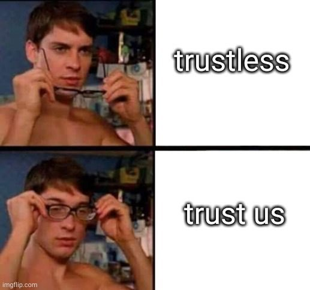

# Trustus

Trust-minimized method for accessing offchain data onchain. No, it's not a joke project.



## Introduction

Suppose we have:

-   A server with an API that provides some useful information (e.g. the weather in Philedelphia today)
-   A smart contract that wants to access said information from the server

How can we implement it? How can we let the smart contract access the offchain data from the server?

One way to do it is to use [Chainlink](https://docs.chain.link/docs/make-a-http-get-request/) to make an HTTP GET request to the server, but this is terrible!

-   We need to rely on Chainlink nodes, whose level of centralization is rather controversial
-   We need to hold LINK tokens in the contract and pay the nodes for each request
-   We need to implement a callback pattern, which is asynchronous and messy

Trustus offers a superior solution that is trust-minimized. Trustus-powered contracts do not rely on any third-party network of nodes, nor do they need to make payments for the requests or implement a callback pattern. The only centralized & trusted component is the server, which has to be trusted anyways, hence the term "trust-minimized".

How is this achieved? Two caveats:

1. The server must implement the specific standard used by Trustus to format the data packet, as well as provide an ECDSA signature that verifies the data packet originated from the trusted server.
2. The smart contract should take in the signed data packet as an input of the function that requires the offchain data and verify its validity. The contract should also keep track of which addresses are trusted to sign the data packets.

The userflow of a call to a Trustus-power smart contract looks like this:

1. The user makes a request to the server to fetch the desired offchain data.
2. The server returns the data packet as well as a signature signed using the server's public key, which should already registered as trusted by the smart contract.
3. The user calls the smart contract, providing the data packet & signature as input.
4. The smart contract verifies & consumes the data packet, and uses the offchain data during the call.

## Installation

To install with [DappTools](https://github.com/dapphub/dapptools):

```
dapp install zeframlou/trustus
```

To install with [Foundry](https://github.com/gakonst/foundry):

```
forge install zeframlou/trustus
```

## Local development

This project uses [Foundry](https://github.com/gakonst/foundry) as the development framework.

### Dependencies

```
make install
```

### Compilation

```
make build
```

### Testing

```
make test
```
